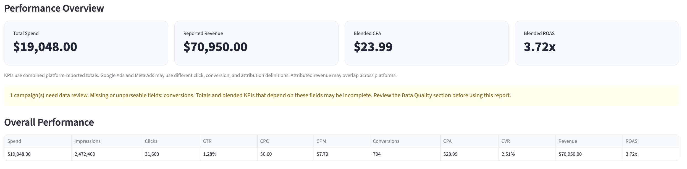
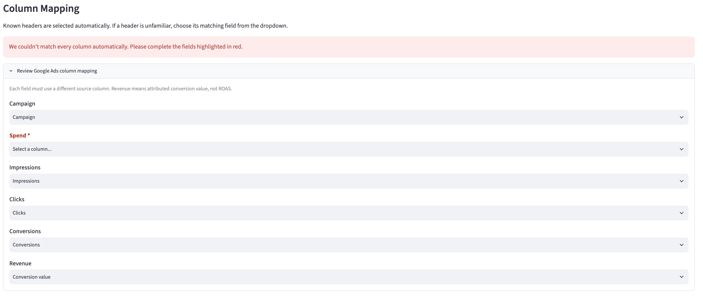
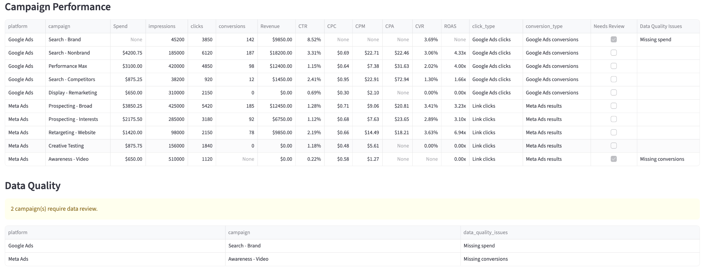

# Marketing Data Cleaner + Report Builder

A Python and Streamlit tool that cleans, standardizes, and combines Google Ads and Meta Ads campaign exports into a single marketing performance report.

## Try the Live App

[Launch the Marketing Data Cleaner + Report Builder](LIVE_APP_URL)

Upload the fictional Google Ads and Meta Ads sample CSVs from the `data/` folder to explore the dashboard.

## The Business Problem

Paid media reporting often starts with repetitive data preparation.

Google Ads and Meta Ads use different column names, export formats, and metric definitions. Before marketers can analyze campaign performance across platforms, they often need to rename columns, clean currency values, calculate KPIs, and identify missing data.

This tool automates those preparation steps so marketers can spend less time formatting spreadsheets and more time interpreting performance.

## Screenshots

### Performance Overview

A consolidated view of paid media performance across Google Ads and Meta Ads, including key KPIs and overall performance totals.



### Flexible Column Mapping

The app automatically recognizes common advertising export headers. When a column name is unfamiliar, the user can map it manually without editing the original CSV.



### Data Quality Review

Campaigns with missing or unparseable performance data are flagged for review, with an explanation of which fields need attention.



## What the Tool Does

### 1. Upload Advertising Data

Upload a Google Ads CSV and a Meta Ads CSV.

The app processes campaign-level data from both platforms and combines it into one standardized report.

### 2. Match Columns Automatically or Manually

The tool recognizes common advertising export headers, even when capitalization or spacing differs.

If a column name is unfamiliar, the app lets the user map it manually. For example, a column named `Total spent` can be mapped to **Spend** without editing the original CSV.

The mapping interface also prevents the same source column from being assigned to multiple report fields.

### 3. Clean and Standardize Data

The cleaner:

- Standardizes campaign, spend, impressions, clicks, conversions, and revenue fields.
- Removes currency symbols and thousands separators from numeric values.
- Converts numeric fields into usable numbers.
- Preserves missing values instead of automatically treating them as zero.
- Identifies the source platform and its click and conversion definitions.

### 4. Calculate Performance Metrics

The app calculates:

| Metric | Calculation |
|---|---|
| CTR | Clicks ÷ Impressions × 100 |
| CPC | Spend ÷ Clicks |
| CPM | Spend ÷ Impressions × 1,000 |
| CPA | Spend ÷ Conversions |
| CVR | Conversions ÷ Clicks × 100 |
| ROAS | Revenue ÷ Spend |

Calculations that require a zero or missing denominator are left undefined rather than producing misleading values.

### 5. Build a Performance Report

The Streamlit dashboard includes:

- A performance overview with key KPIs.
- Overall performance totals.
- A platform-level performance comparison.
- Campaign-level performance data.
- A data-quality review section.
- A downloadable combined CSV report.

### 6. Flag Data-Quality Issues

The tool identifies campaigns with missing or unparseable values in:

- Spend
- Impressions
- Clicks
- Conversions
- Revenue

Flagged campaigns include a description of the issue so the user knows what to investigate.

A reported value of `0` is treated differently from a missing value.

## Technologies Used

- **Python:** Data-processing logic and KPI calculations.
- **pandas:** CSV cleaning, standardization, and data aggregation.
- **Streamlit:** Interactive upload interface, column mapping, dashboard, and report download.
- **Git and GitHub:** Version control and project documentation.

## How to Run Locally

Clone the repository:

```bash
git clone https://github.com/v-villena/marketing-data-cleaner.git
cd marketing-data-cleaner
```

Install the required packages:

```bash
pip install -r requirements.txt
```

Start the Streamlit app:

```bash
streamlit run app.py
```

Upload the sample files from the `data/` folder:

- `google_ads.csv`
- `meta_ads.csv`

These files contain fictional campaign data for demonstration and testing.

## Sample Data and Testing

The project includes a Google Ads test file with alternate column names, currency formatting, thousands separators, and extra export fields:

`data/google_ads_messy_test.csv`

The tool has also been tested against:

- Zero conversions.
- Missing spend.
- Missing conversions.
- Empty CSV data.
- Unfamiliar column names.
- Duplicate column mappings.

## Important Reporting Considerations

Google Ads and Meta Ads may use different click, conversion, and attribution definitions.

Combined platform-reported conversions and revenue should therefore be interpreted with care. Attributed revenue may overlap across platforms, and missing data may make some totals or blended KPIs incomplete.

This tool standardizes and reports the uploaded data. It does not reconcile attribution between advertising platforms.

## Project Goal

Build a practical reporting utility that reduces repetitive spreadsheet preparation and makes cross-platform campaign data easier to review, validate, and export.